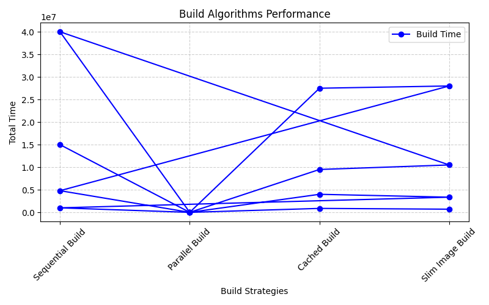
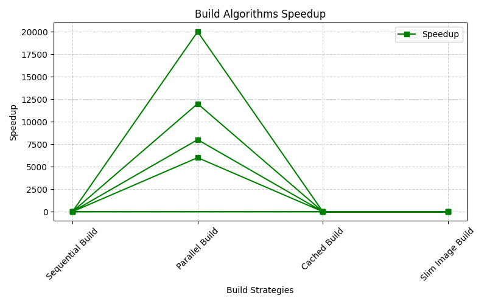
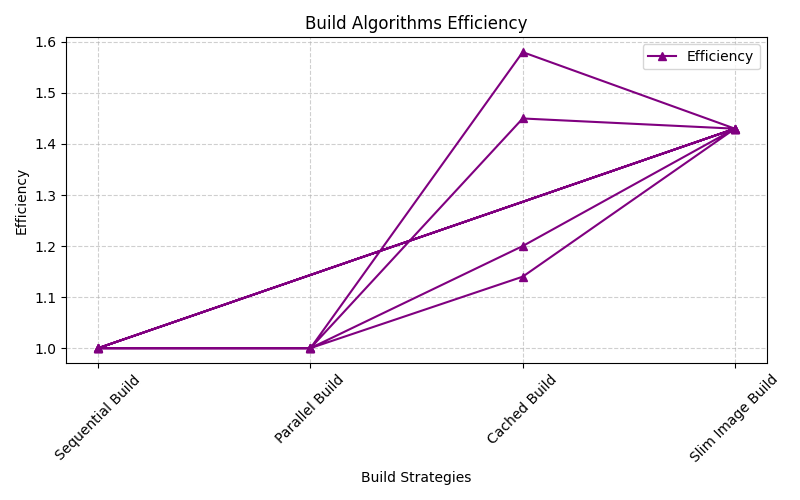
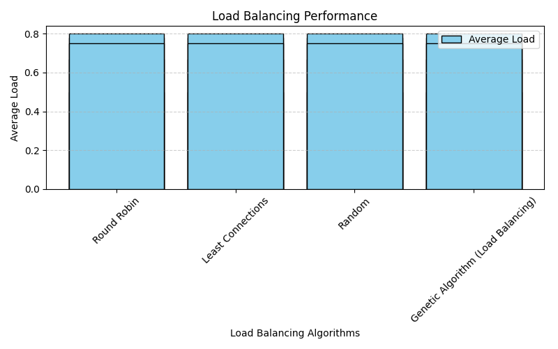
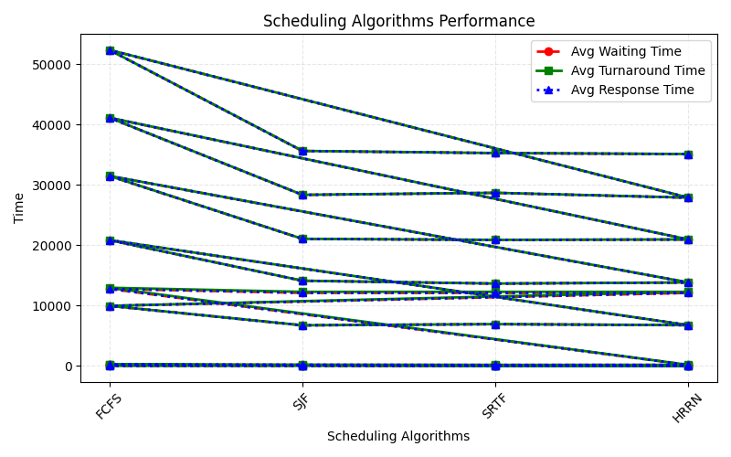
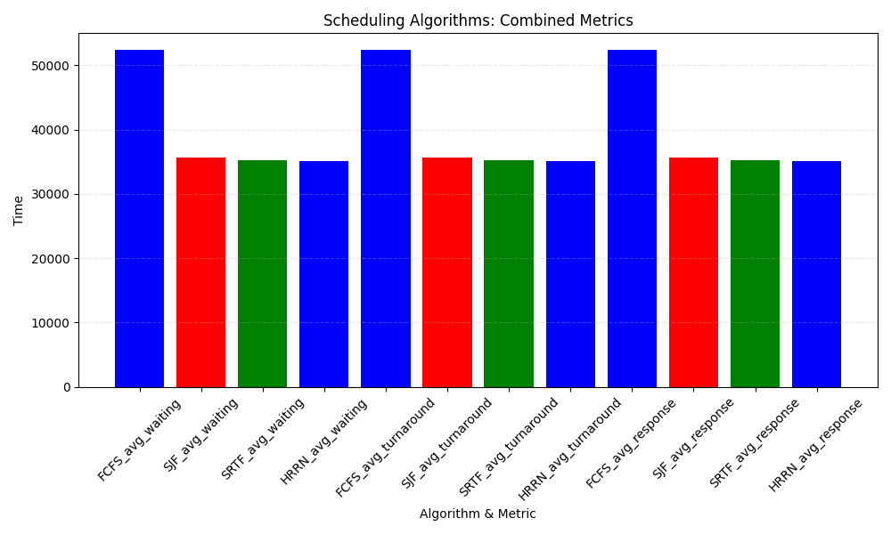

CI/CD Speed Simulator- Cloud Computing Project
Project Overview:
    The CI/CD Speed Simulator is a performance analysis tool designed to evaluate different strategies in build phases, load balancing, and scheduling algorithms that directly impact the efficiency of cloud-based CI/CD pipelines.

     Why this project matters

    In real-world cloud systems, optimizing build times, resource allocation, and request scheduling is critical for:
    (a)Faster deployments 
    (b)Better utilization of compute resources
    (c)Reduced waiting and turnaround times
    (d)Fairer load distribution across servers 

    This simulator provides a controlled environment to measure and compare performance metrics such as:
    (a)Total Time & Speedup ->  How much faster builds run with parallelism, caching, or slim image techniques.
    (b)Efficiency -> How effectively resources are used in cloud builds.
    (c)Avg/Max/Min Load & Load Imbalance -> How evenly load balancing strategies distribute workload across servers.
    (d)Fairness Index & Variance -> How fairly cloud resources are allocated.
    (e)Avg Waiting, Turnaround & Response Times -> How different scheduling algorithms (FCFS, SJF, SRTF, HRRN) impact process execution.

    Relation to Cloud Computing

    (a)Build Phase -> Mirrors container builds in CI/CD pipelines where caching and slim images drastically reduce build times (similar to Docker build optimization in cloud CI/CD).

    (b)Load Balancing Phase -> Simulates how cloud providers distribute incoming traffic (Round Robin, Least Connections, Random, or even Genetic Algorithm–based optimization).

    (c)Scheduling Phase -> Represents CPU scheduling in virtualized cloud environments, affecting response times for users and processes.

    (d)Thus, this project models end-to-end pipeline efficiency in cloud computing — from building and deploying software to handling live user workloads.

Technology Stack:
    (a)Python 3.12.3
    (b)Pandas, Matplotlib
    (c)Docker, docker-compose
    (d)Git for version control

Features:
    (a)Build Phase Simulation
    
        (i)Supports multiple build strategies: Sequential, Parallel, Cached, and Slim Image builds.
        (ii)Measures Total Time, Speedup, and Efficiency for each strategy.

    (b)Load Balancing Simulation

        (i)Implements algorithms like Round Robin, Least Connections, Random, and Genetic Algorithm.
        (ii)Records Average Load, Max/Min Load, Variance, Fairness Index, and Load Imbalance.

    (c)Scheduling Algorithms Simulation

        (i)Supports FCFS, SJF, SRTF, HRRN (with potential extension to RR, Priority, etc.).
        (ii)Tracks Average Waiting Time, Turnaround Time, and Response Time.

    (d)CSV Data Logging

        (i)All simulation results are automatically saved into logs/results.csv.
        (ii)Provides reproducible datasets for later analysis.

    (e)Graphical Analysis

        (i)Generates clear Matplotlib plots to compare strategies visually.
        (ii)Helps derive conclusions from real data instead of assumptions.
Methodology:
    1. Build Phase (Service Initialization in Cloud)

        In a real CI/CD pipeline, services (e.g., microservices or containers) must be built before deployment. This project simulates different build strategies:

        (a)Sequential Build – like building one container at a time.

        (b)Parallel Build – building multiple services simultaneously (cloud auto-scaling analogy).

        (c)Cached Build – reusing previously built layers/images to save time.

        (d)Slim Image Build – optimizing builds by removing unnecessary dependencies.

        These directly reflect cloud-native DevOps practices where speedup and efficiency in builds reduce deployment time and resource usage.

    2. Load Balancing Phase (Cloud Traffic Distribution)

        In cloud environments, traffic must be distributed across multiple servers/VMs/containers to avoid bottlenecks. This project implements and evaluates:

        (a)Round Robin – equal distribution of requests.

        (b)Least Connections – directing traffic to the least busy server.

        (c)Random – distributing requests without state.

        (d)Genetic Algorithm-based Balancing – intelligent optimization for fairness and load distribution.

        Metrics like average load, max/min load, fairness index, variance, and imbalance show how well the algorithms keep cloud servers balanced and ensure high availability.

    3. Scheduling Phase (Cloud Task Scheduling)

        After load balancing, tasks are scheduled within servers (like VMs or Kubernetes pods). The simulator tests classical scheduling algorithms:

        (a)FCFS (First Come First Serve) – simple but may cause waiting delays.

        (b)SJF (Shortest Job First) / SRTF (Shortest Remaining Time First) – minimize waiting, suitable for bursty cloud workloads.

        (c)HRRN (Highest Response Ratio Next) – balances fairness and efficiency.

        Metrics analyzed include average waiting time, turnaround time, and response time, which mirror QoS (Quality of Service) in cloud scheduling.

Graphs:
(1)Build Phase

(2)Load Balancing Phase

(3)Scheduling Phase

Results and Analysis:
1. Build Phase (Baseline = Sequential Build)
    Observations from graphs and dataset:
    (a)Sequential Build consistently has the highest total build time across all sets.
    
    (b)Parallel Build shows massive speedups (up to 20,000x) in larger datasets, maintaining efficiency = 1.0, indicating perfect scaling.

    (c)Cached Build shows moderate improvements (1.14x–1.58x speedup); very useful for incremental builds.

    (d)Slim Image Build demonstrates consistent speedup (~1.43x) across datasets with stable efficiency.

    Insights from generated graphs:
    (a)build_total_time.png clearly highlights Parallel Build dominance.
    
    (b)build_speedup.png shows dramatic gains of parallelism over other strategies.

    (c)build_efficiency.png confirms scaling effectiveness for each strategy.

    Conclusion
    (a)Parallel Build > Slim Image Build > Cached Build > Sequential Build

    (b)Parallel Build maximizes speedup for large-scale deployments.

    (c)Slim Image Build provides consistent efficiency.

    (d)Cached Build is ideal for incremental builds.

2. Load Balancing Phase (Baseline = Round Robin)

    Observations from graphs and dataset:

    (a)Round Robin and Least Connections maintain balanced server loads with low variance and high fairness index (0.50–0.80).

    (b)Random distribution causes uneven load distribution (variance up to 0.8, fairness index ~0.33–0.44).

    (c)Genetic Algorithm improves load distribution intelligently, slightly lower fairness than Round Robin but reduces imbalance.

    Insights from generated graphs:

    (a)load_avg_load.png shows average server loads for each algorithm.

    (b)load_variance.png highlights variance across servers, showing which algorithms produce uneven loads.

    (c)load_fairness.png demonstrates fairness index; Round Robin/Least Connections are simple yet highly fair.

    (d)load_imbalance.png depicts imbalance metrics, useful for understanding dynamic load conditions.

    Conclusion

    (a)Round Robin / Least Connections -> simple and effective for predictable traffic.

    (b)Genetic Algorithm -> optimized for dynamic, high-load environments.

    (c)Random -> suitable for testing or low-impact scenarios only.

3. Scheduling Phase (Baseline = FCFS)

    Observations from graphs and dataset:

    (a)FCFS exhibits highest waiting and turnaround times, confirming baseline inefficiencies.

    (b)SJF and SRTF significantly reduce average waiting and turnaround times, suitable for CPU-bound cloud workloads.

    (c)HRRN balances fairness and efficiency, slightly higher waiting times than SJF/SRTF but more equitable task execution.

    Insights from generated graphs:

    (a)scheduling_times.png shows time metrics for each algorithm (waiting, turnaround, response).

    (b)scheduling_combined.png allows side-by-side comparison of all metrics, highlighting preemptive algorithms’ advantages.

    (c)Trends across multiple dataset sets show consistent behavior, reinforcing simulation validity.

    Conclusion

    (a)SJF/SRTF -> maximize performance in bursty workloads.

    (b)HRRN -> balances fairness and efficiency.

    (c)FCFS -> baseline, demonstrates inefficiencies.

Future Work:
    This project currently focuses on simulation, analysis, and visualization of build time, load balancing, and scheduling algorithms. In the future, the following extensions can be added:

    (a)Cloud Deployment:    Containerize the simulator with Docker and deploy on AWS/GCP/Azure.

    (b)Web Dashboard:   Develop a lightweight Flask/Django or React-based dashboard to run simulations and visualize results online.

    (c)Scalability Tests:   Extend the dataset (`results.csv`) with larger workloads to benchmark algorithms under real-world scale.

    (d)Integration with CI/CD Tools:    Explore connecting the simulator with Jenkins/Kubernetes pipelines for closer-to-production analysis.
